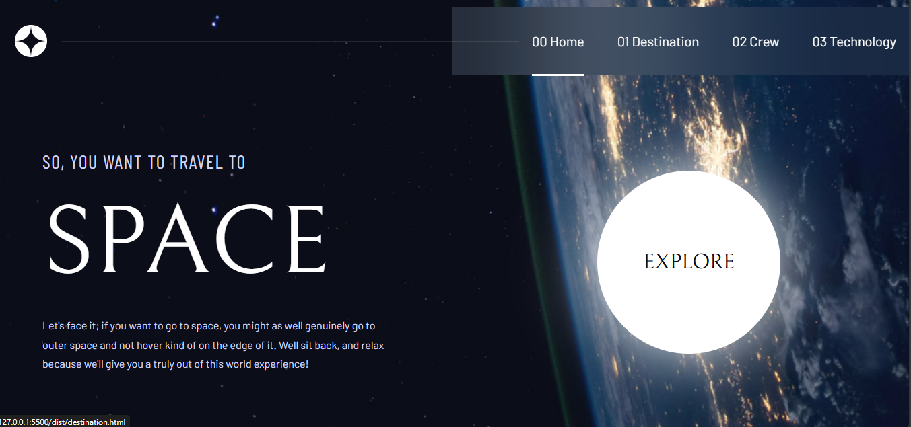

# Frontend Mentor - Space tourism website solution

This is a solution to the [Space tourism website challenge on Frontend Mentor](https://www.frontendmentor.io/challenges/space-tourism-multipage-website-gRWj1URZ3). Frontend Mentor challenges help you improve your coding skills by building realistic projects. 

## Table of contents

- [Overview](#overview)
  - [The challenge](#the-challenge)
  - [Screenshot](#screenshot)
  - [Links](#links)
- [My process](#my-process)
  - [Built with](#built-with)
  - [What I learned](#what-i-learned)
  - [Continued development](#continued-development)
  - [Useful resources](#useful-resources)
- [Author](#author)

## Overview

### The challenge

Users should be able to:

- View the optimal layout for each of the website's pages depending on their device's screen size
- See hover states for all interactive elements on the page
- View each page and be able to toggle between the tabs to see new information

### Screenshot

### Links

- Solution URL: [Add solution URL here](https://your-solution-url.com)
- Live Site URL: [Netlify](https://zippy-cobbler-74f62d.netlify.app/)

## My process

### Built with

- Semantic HTML5 markup
- SCSS
- Flexbox
- Grid
- Mobile-first workflow
- Gulp
- Npm

### What I learned

In the web course I am taking right now I worked with SCSS and gulp and I wanted to use those technologies in a FrontEnd Mentor Challenge and this was a perfect one. I learned a lot about SCSS and Gulp. I like those technologies because I had my files more organized, for example, the layout folder is for components (thing that I am gonna use more than once)  and the pages folder is for the SCSS of each page. Something that I saw while working in this project is that it is so much easier to work if you have the figma files because you can see all the exact styles.

### Continued development

While I take the web course, I am going to try to practice the skills I'm learning in more FrontEnd Mentor Challenges.

### Useful resources

- [w3schools.com](https://www.w3schools.com/) - I love to check this website for anything related to front-end technologies.

## Author

- Frontend Mentor - [@SnakeZ115](https://www.frontendmentor.io/profile/SnakeZ115)

